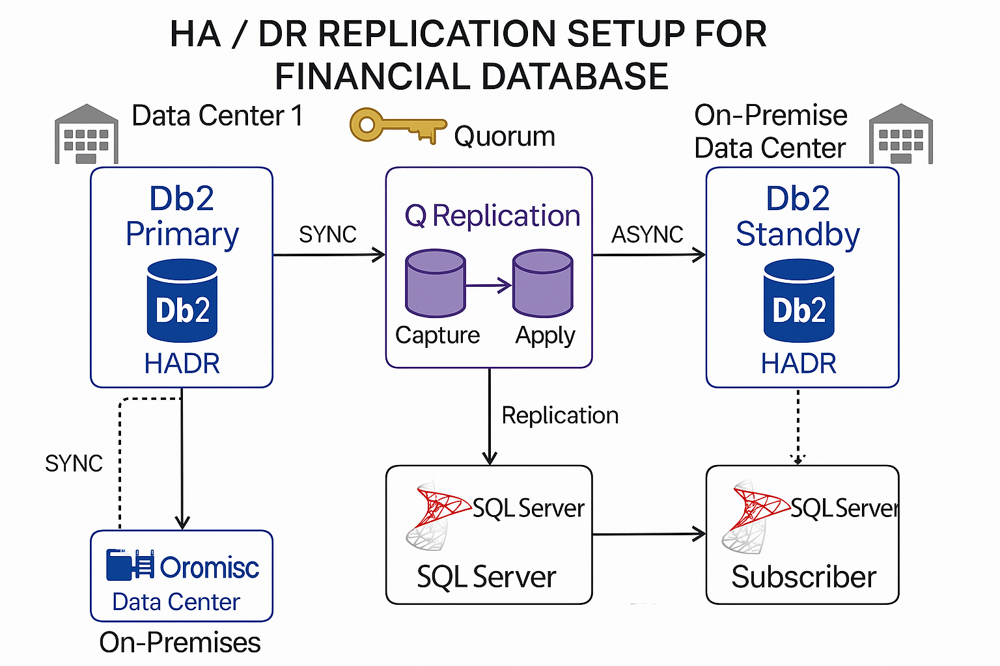

# 🛡️ HA/DR & Q Replication Setup for Financial Databases

This project demonstrates a production-grade **High Availability and Disaster Recovery** setup for mission-critical financial systems using **IBM Db2 HADR**, **Q Replication**, and **SQL Server replication**.

It includes real-world configurations, monitoring hooks, SOPs, and a detailed architecture diagram — designed to minimize downtime and data loss.

---

## 🧭 Architecture Overview



## ⚙️ Key Features

- ✅ **Failover SOP** for both Db2 and SQL Server
- ✅ **Q Replication** configured for near-real-time sync
- ✅ **Monitoring hooks** with mock alerts and uptime logs
- ✅ **Real-world config files** for high availability
- ✅ Designed for **financial-grade reliability** (99.99% uptime goal)

- ## 👩‍💻 Tech Stack

| Category        | Tools & Technologies                                 |
|----------------|-------------------------------------------------------|
| Databases       | IBM Db2 11.5, SQL Server 2019                         |
| Replication     | Q Replication, SQL Server Publisher–Subscriber       |
| HA/DR Setup     | Db2 HADR, SQL Server AlwaysOn                        |
| Automation      | Bash, PowerShell, SQL Scripts                        |
| Monitoring/Logs | Custom log tracking, simulated alerts, failover SOPs |

**Components:**
- **Db2 Primary/Standby (HADR)**: Synchronous or super-async configuration
- **Q Replication**: For near-real-time CDC from Db2 to SQL Server
- **SQL Server Publisher–Subscriber**: For downstream reporting or analytics
- **Monitoring**: Custom alerts, uptime tracking, SOPs for failover and rollback

---


## 📂 Folder Structure

```bash
ha-replication-setup-financial-db/
│
├── config/
│   ├── db2_hadr_primary.cfg
│   ├── db2_hadr_standby.cfg
│   ├── sqlserver_alwayson_cluster_setup.sql
│   └── auto_failover_sop.md
│
├── monitoring/
│   ├── hadr_uptime_log.txt
│   ├── qrep_status_checks.sql
│   ├── failover_alerts_mock.json
│
├── diagrams/
│   └── ha_dr_replication_architecture.png
│
└── README.md
``` 

---

## 📌 Why This Matters

In high-stakes environments like finance, **downtime is not negotiable**.  
This HA/DR setup ensures:

- 🔄 Seamless failover with minimal data loss
- 🔐 Replication that supports live reporting even during disruptions
- 🧪 Continuous monitoring and alerts for faster incident response

This project reflects real-world experience in **designing reliable data infrastructure** that protects both business continuity and customer trust.

---
